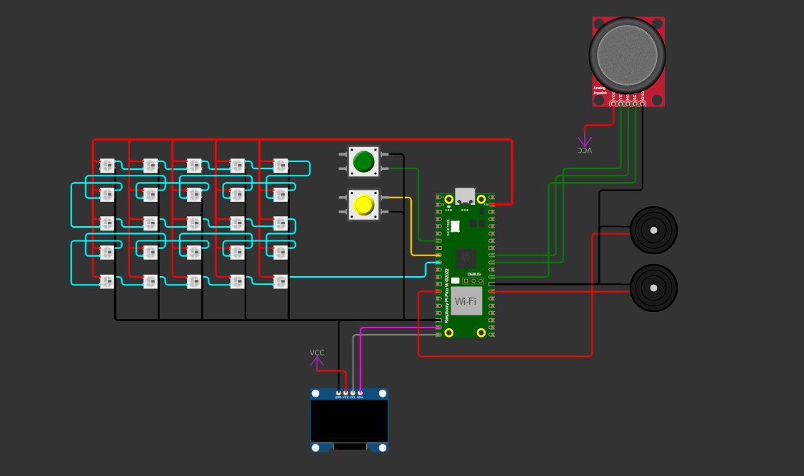

<table>
  <tr>
    <td>
      
    </td>
    <td>
      <h1>💡 Sistema Embarcado para Monitoramento da Esteira </h1>
    </td>
  </tr>
</table>


**Autor:** Otiliano Rodrigues de Souza Junior  
**Data:** 26/02/2025

---

Este projeto simula o funcionamento de uma esteira transportadora, possibilitando o controle dinâmico do número de blocos e da velocidade de operação. Utilizando botões, joystick, uma matriz de LEDs e um display OLED, o sistema também simula falhas e modos de manutenção, permitindo uma visualização em tempo real do status da esteira.

---

## Objetivos

- ✅ Controlar a quantidade de blocos em movimento na esteira através do botão A.
- ✅ Ajustar a velocidade da esteira utilizando o eixo Y do joystick.
- ✅ Alternar o modo de manutenção/resumo via botão do joystick.
- ✅ Simular falhas na operação (acionamento de buzzer e indicação na matriz de LEDs) através do botão B.
- ✅ Exibir informações como velocidade, número de blocos e contagem de ciclos no display OLED.
- ✅ Visualizar feedback visual na matriz de LEDs (utilizando LEDs WS2812).

---

## Materiais Necessários

- 🔹 1x Raspberry Pi Pico W (RP2040)
- 🔹 1x Display OLED (SSD1306 via I2C)
- 🔹 1x Matriz de LEDs (25 LEDs WS2812, 5x5)
- 🔹 2x Buzzers (BUZZER_A e BUZZER_B)
- 🔹 1x Joystick (com eixo analógico e botão)
- 🔹 3x Botões (Botão A para alterar itens, Botão B para simular falha e botão do joystick para manutenção)
- 🔹 Fios e protoboard para conexões

---

## Configuração dos Componentes

### Distribuição dos Pinos no Raspberry Pi Pico

| Componente                   | Função/Descrição                                     | Pino GPIO/Função          |
|------------------------------|------------------------------------------------------|---------------------------|
| **Botão A**                  | Incrementa/Decrementa o número de blocos             | GPIO 5                    |
| **Botão B**                  | Ativa/desativa o modo de falha                       | GPIO 6                    |
| **Joystik – Eixo Y (ADC)**     | Ajusta a velocidade da esteira                      | ADC no GPIO 26            |
| **Joystik – Botão**          | Alterna o estado de manutenção da esteira            | GPIO 22                   |
| **Buzzers**                  | Emitem tom de alarme durante falhas                  | BUZZER_A: GPIO 21 <br> BUZZER_B: GPIO 10 |
| **Matriz de LEDs**           | Exibe feedback visual (ex.: falhas, padrões)         | Ex.: GPIO 7               |
| **Display OLED (SSD1306)**   | Mostra informações de operação (velocidade, itens, total de ciclos) | I2C_SDA: GPIO 14 <br> I2C_SCL: GPIO 15 |

---

## Implementação

1. **Simulação da Esteira**
   - A função `simular_esteira()` gerencia a atualização do display OLED, exibindo:
     - Velocidade atual (percentual)
     - Quantidade de blocos ativos na esteira
     - Total de ciclos (contagem de blocos que completaram o trajeto)
   - Desenha a esteira com blocos móveis e linhas de delimitação.

2. **Controle de Blocos (Alterar Itens)**
   - Utiliza o **Botão A** para incrementar ou decrementar o número de blocos.
   - Quando o número máximo ou mínimo é atingido, o modo de incremento/decremento é invertido.
   - Feedback via serial é emitido para confirmação.

3. **Ajuste de Velocidade via Joystick**
   - Leitura do ADC (eixo Y) para ajustar a velocidade da esteira.
   - Existe uma zona morta para evitar ajustes indesejados.
   - A velocidade é limitada entre valores mínimos e máximos (ex.: 10% a 100%).
   - Feedback via serial informa a nova velocidade.

4. **Simulação de Falha e Modo de Manutenção**
   - **Falha:** Ao acionar o **Botão B**, o sistema alterna entre os estados de operação normal e falha.
     - Durante a falha, o buzzer toca notas e a matriz de LEDs pisca em vermelho.
   - **Manutenção:** O botão do joystick ativa ou desativa o modo de manutenção.
     - No modo de manutenção, a esteira é pausada e uma mensagem é exibida no display OLED.

5. **Feedback Visual e Sonoro**
   - **Display OLED:** Mostra informações atualizadas da operação.
   - **Matriz de LEDs:** Apresenta padrões de LEDs (incluindo indicação de falha com padrão vermelho).
   - **Buzzers:** Emitem um tom para alertar a ocorrência de falhas.

---

## Clonando o Repositório e Compilando o Código

Para baixar o código e iniciar o desenvolvimento:

1. **Clonando o Repositório:**

   ```bash
   git clone https://github.com/otilianojunior/embarcatech_esteira.git
   cd esteira-monitor
   ```

2. **Compilando e Carregando o Código:**
   - Configure seu ambiente de desenvolvimento para o Raspberry Pi Pico W.
   - Utilize o CMake e a toolchain do Pico SDK para compilar.
   - Carregue o firmware gerado na placa via USB.

---

## Demonstração do Projeto

- **Simulação no Wokwi:**  
  Você pode visualizar o modelo do projeto no  [wokwi](https://wokwi.com/projects/423991918540076033).  
  

- **Demonstração Real:**  
  Confira a prévia do display OLED e da matriz de LEDs durante a operação na BitDogLab, [vídeo](https://drive.google.com/drive/folders/1kRuxR5OX1Ikjl-Q9tCTuqjdFFuxtPNQY).  
   

---
## 📁 Entregáveis

- **Código-Fonte:**  
  Todo o código fonte deste projeto encontra-se neste repositório.

- **vídeo Ensaio:**  
  [Link para o Vídeo](https://drive.google.com/drive/folders/1kRuxR5OX1Ikjl-Q9tCTuqjdFFuxtPNQY)

- **Relatório Completo:**  
  [Link para o Documento](https://docs.google.com/document/d/11jMEasb0TE-p_USpGYFvF3HtJ2VkPhx13ZEOz7g1GBo/edit?tab=t.0#heading=h.2fznn6w8rfeg)


## Melhorias Futuras

- 📡 **Integração Wi‑Fi:** Inclusão de monitoramento remoto e controle via servidor HTTP.
- 🔄 **Aprimoramento do Controle:** Otimização do ajuste de velocidade e resposta dos botões.
- 🖥 **Interface Gráfica Avançada:** Exibição de gráficos e estatísticas detalhadas via servidor HTTP.
- 📶 **Comunicação Serial:** Adição de logs detalhados e monitoramento via UART.

---

## Referências

Este projeto foi inspirado em implementações anteriores e adaptações realizadas por projetos como o [BitDogLab](https://github.com/BitDogLab/BitDogLab), adaptando as funcionalidades para simulação de esteiras e controle embarcado.

---